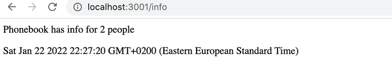

# Exercises 3.1.-3.6

**NB:** It's recommended to do all of the exercises from this part into a new dedicated git repository, and place your source code right at the root of the repository. Otherwise, you will run into problems in exercise 3.10.

**NB:** Because this is not a frontend project and we are not working with React, the application is not created with `create vite@latest -- --template react`. You initialize this project with the `npm init` command that was demonstrated earlier in this part of the material.

**Strong recommendation:** When you are working on backend code, always keep an eye on what's going on in the terminal that is running your application.

## 3.1: Phonebook backend step 1

Implement a Node application that returns a hardcoded list of phonebook entries from the address <http://localhost:3001/api/persons>.

Data:

```json
[
  {
    "id": 1,
    "name": "Arto Hellas",
    "number": "040-123456"
  },
  {
    "id": 2,
    "name": "Ada Lovelace",
    "number": "39-44-5323523"
  },
  {
    "id": 3,
    "name": "Dan Abramov",
    "number": "12-43-234345"
  },
  {
    "id": 4,
    "name": "Mary Poppendieck",
    "number": "39-23-6423122"
  }
]
```

Output in the browser after GET request:


Notice that the forward slash in the route _api/persons_ is not a special character, and is just like any other character in the string.

The application must be started with the command `npm start`.

The application must also offer an `npm run dev` command that will run the application and restart the server whenever changes are made and saved to a file in the source code.

## 3.2: Phonebook backend step 2

Implement a page at the address <http://localhost:3001/info> that looks roughly like this:



The page has to show the time that the request was received and how many entries are in the phonebook at the time of processing the request.

There can only be one response.send() statement in an Express app route. Once you send a response to the client using response.send(), the request-response cycle is complete and no further response can be sent.

To include a line space in the output, use `<br/>` tag, or wrap the statements in `<p>` tags.

## 3.3: Phonebook backend step 3

Implement the functionality for displaying the information for a single phonebook entry. The url for getting the data for a person with the id 5 should be <http://localhost:3001/api/persons/5>

If an entry for the given id is not found, the server has to respond with the appropriate status code.
