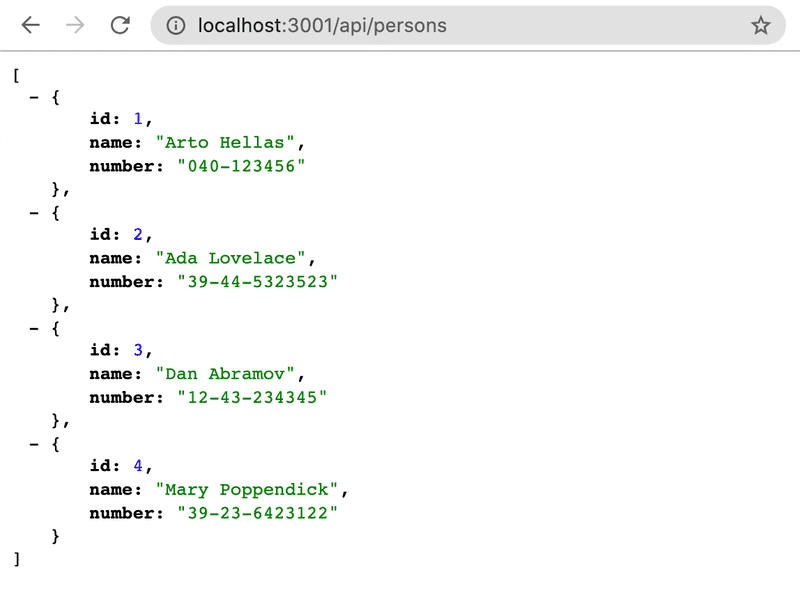

# Exercises 3.1.-3.6

**NB:** It's recommended to do all of the exercises from this part into a new dedicated git repository, and place your source code right at the root of the repository. Otherwise, you will run into problems in exercise 3.10.

**NB:** Because this is not a frontend project and we are not working with React, the application is not created with `create vite@latest -- --template react`. You initialize this project with the `npm init` command that was demonstrated earlier in this part of the material.

**Strong recommendation:** When you are working on backend code, always keep an eye on what's going on in the terminal that is running your application.

## 3.1: Phonebook backend step 1

Implement a Node application that returns a hardcoded list of phonebook entries from the address <http://localhost:3001/api/persons>.

Data:

```json
[
  {
    "id": 1,
    "name": "Arto Hellas",
    "number": "040-123456"
  },
  {
    "id": 2,
    "name": "Ada Lovelace",
    "number": "39-44-5323523"
  },
  {
    "id": 3,
    "name": "Dan Abramov",
    "number": "12-43-234345"
  },
  {
    "id": 4,
    "name": "Mary Poppendieck",
    "number": "39-23-6423122"
  }
]
```

Output in the browser after GET request:



Notice that the forward slash in the route _api/persons_ is not a special character, and is just like any other character in the string.

The application must be started with the command `npm start`.

The application must also offer an `npm run dev` command that will run the application and restart the server whenever changes are made and saved to a file in the source code.
